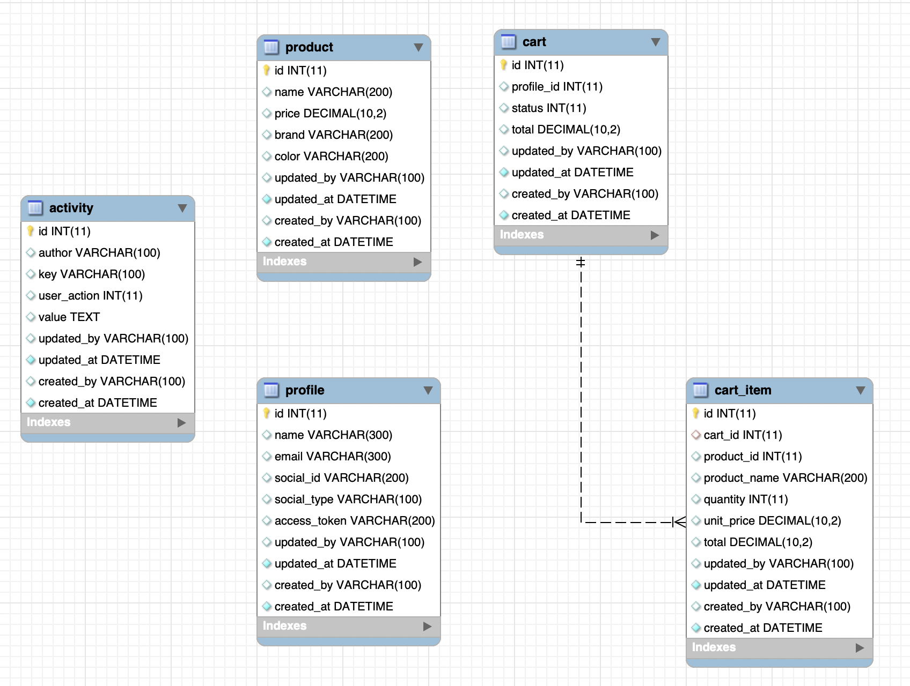
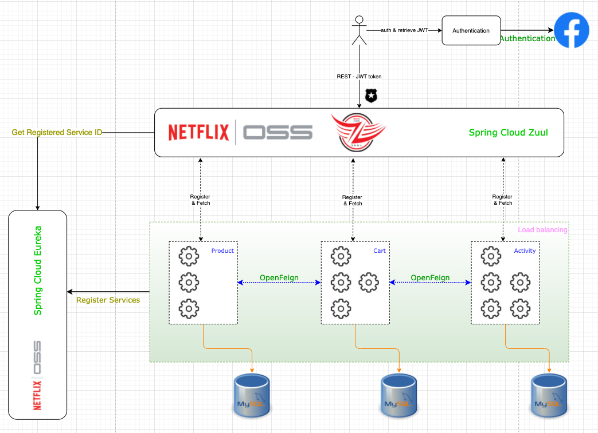
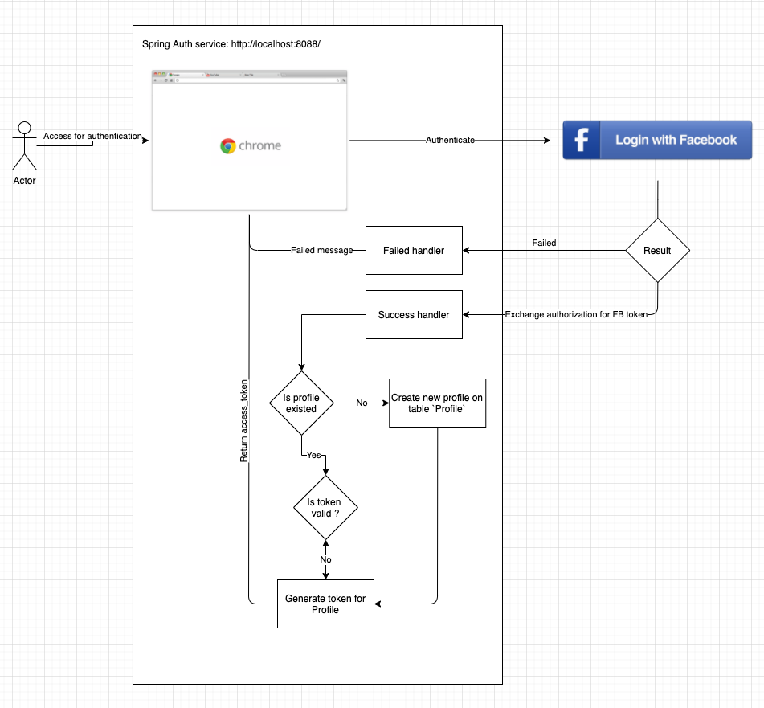

# iCommerce MVP project

This project is a minimum viable project for running e-commerce shopping cart with functions:

  - Search products with given or not: name, brand, color, price from - price to
  - A Shopping cart that allow user to add/update product quantity, submit cart
  - Activity service for recording user activity: search products, view product detail, updating price of product
  - Authenticate user with Facebook login

# Component listing:
| Component | Description|
| ------ | ------ |
| [Eureka Server] | Micro Services registration |
| [Zuul Service] | Service gateway |
| [Auth Api] | for Facebook authentication login and generating token |
| [Activity Api] | Activity management |
| [Cart Api] | Cart management |
| [Product Api] | Product management |
| [Common] | Common entity, setting, exception, payload that sharing usage for all services |

# Database Diagram ⚛


Table Explain: 
| Table | Description|
| ------ | ------ |
| profile | Contain profile synced from FB log-in with access_token will be generated first-time, for communicate with other services |
| product | Basic structure for Product model with given name, price, brand, color |
| cart | Profile's carts with 2 possible status: PENDING, FINISHED. 1 profile can have many carts but only 1 PENDING, using for add-to-cart and submit action. |
| cart_item | Entity related to cart with fixed product name, unit_price, and these data will be up-to-date if cart is PENDING. |
| activity | For storing User's action activity like: PRODUCT_LIST, PRODUCT_DETAIL, PRODUCT_UPDATE, CARD_ADD, CART_CHECKOUT |

# Architect & Flow✰
#### Architect


#### Flows

###### Login flow


# Run Application ✅
#### Software / Tool need:
 - Maven
 - Java 8+
 - Docker
 - Browser - Facebook Account: for authentication
 - Postman: for testing

### MySQL:
1. Bring the database to live
```sh
docker run --name my-mysql -v /your-volumes:/var/lib/mysql -e MYSQL_ROOT_PASSWORD=123456 -p 3306:3306 -d mysql:8.0
```
2. Create new database name **icommerce**

### Start Services

#### Start Service as order with command:

> mvn spring-boot:run -DskipTest=true

1. Eureka Server
2. Zuul
3. Microservice Auth
4. Microservice Product
5. Microservice Cart
6. Microservice Activity
> After all services started, import default [product sample file] for application experience

##### Service Urls
The endpoint for each service
| Service | URL |
| ------ | ------ |
| Eureka Server | http://localhost:8761 |
| Zuul | http://localhost:8762 |
| Service Auth | http://localhost:8088 |
| Service Activity | http://localhost:7070 |
| Service Cart | http://localhost:7071 |
| Service Product | http://localhost:7072 |

#### Application flow
1. Authenticate request by accessing Service Auth at: http://localhost:8088
2. Copy the access-token return for app usage
3. Open Postman, import [postman file], input the access-token into Authorization Bearer (header: Authorization: Bearer toke-text)
4. To list all Products
```sh
GET http://localhost:8762/product/
```
5. To view product detail
```sh
GET http://localhost:8762/product/{id}
```
6. Search for a product
```sh
GET http://localhost:8762/product?priceFrom={priceFrom}&priceTo={priceTo}&name={name}&brand={bran}&color={color}
``` 
7. To update product's price by id
```sh
PUT http://localhost:8762/product/{id}
body
{
    "id": 1,
    "name": "product 1",
    "price": 15.0
    "brand": "brand-1",
    "color": "color-1",
    "ordered": 0
}
```
8. Get current cart
```sh
GET http://localhost:8762/cart
```
9. Put a product to cart
```sh
PUT http://localhost:8762/cart/{productId}/{quantity}
```
10. Submit Cart
```sh
POST http://localhost:8762/cart
```

License
----

MIT


**Feel free to contribute and learning

[Eureka Server]: <https://github.com/icommerce-thang/i_eureka_server>
[Zuul Service]: <https://github.com/icommerce-thang/i_zuul>
[Auth Api]: <https://github.com/icommerce-thang/i_auth>
[Activity Api]: <https://github.com/icommerce-thang/i_activity>
[Cart Api]: <https://github.com/icommerce-thang/i_cart>
[Product Api]: <https://github.com/icommerce-thang/i_product>
[Common]: <https://github.com/icommerce-thang/i_common>
[product sample file]: <https://github.com/icommerce-thang/i_common/blob/main/asserts/data-product.sql>
[postman file]: <https://github.com/icommerce-thang/i_common/blob/main/asserts/icommerce.postman_collection.json>


